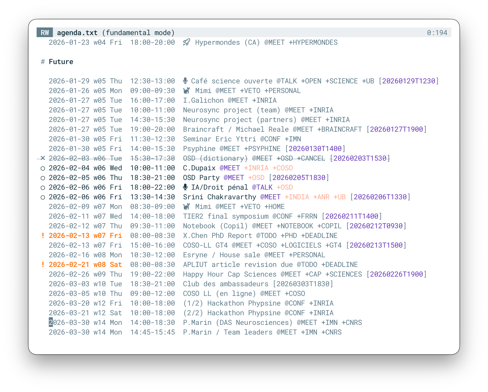
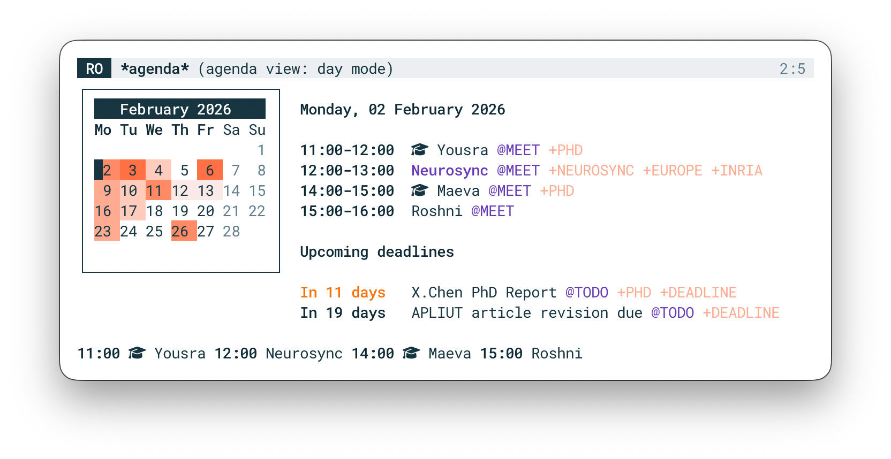
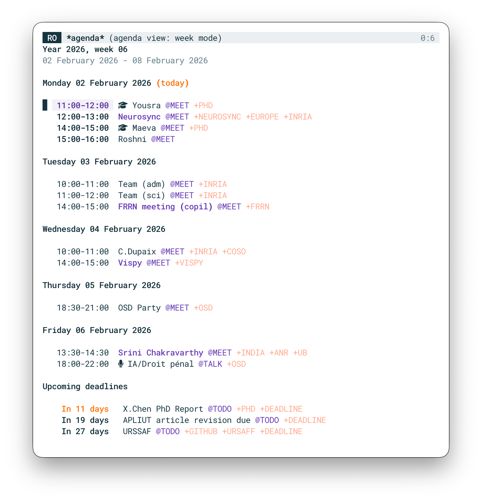
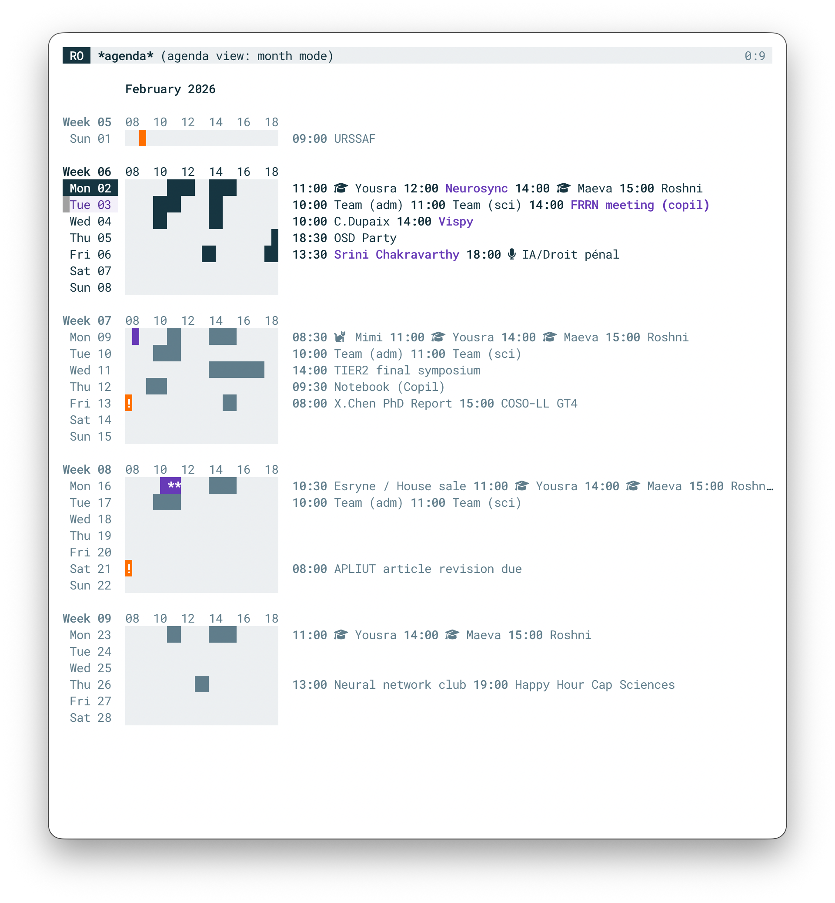
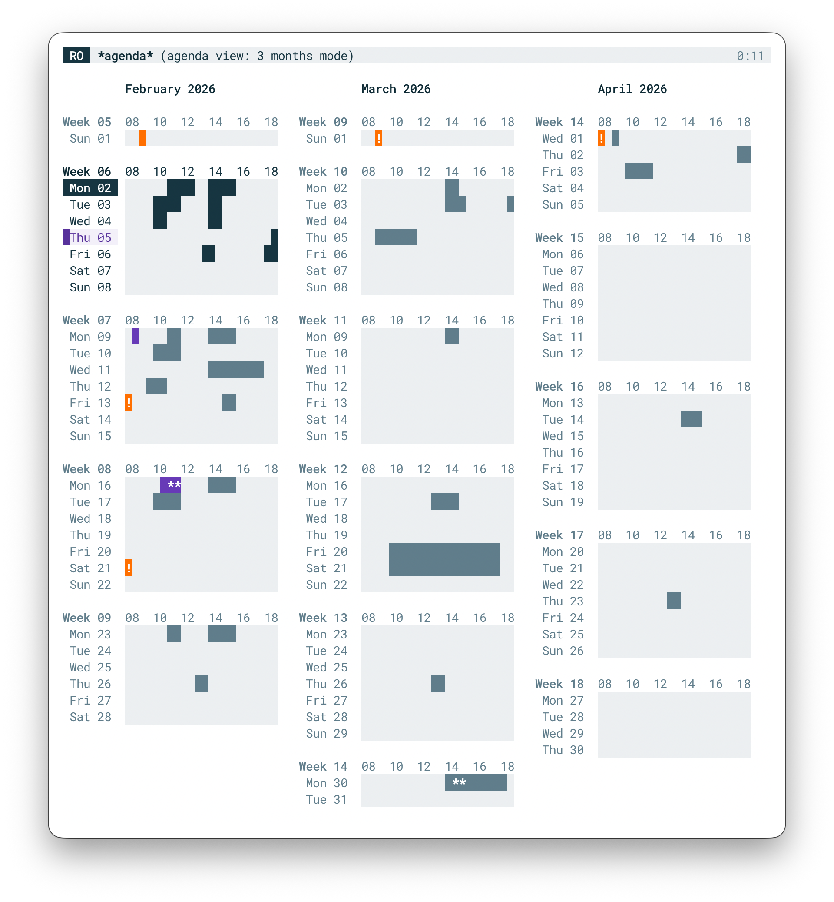
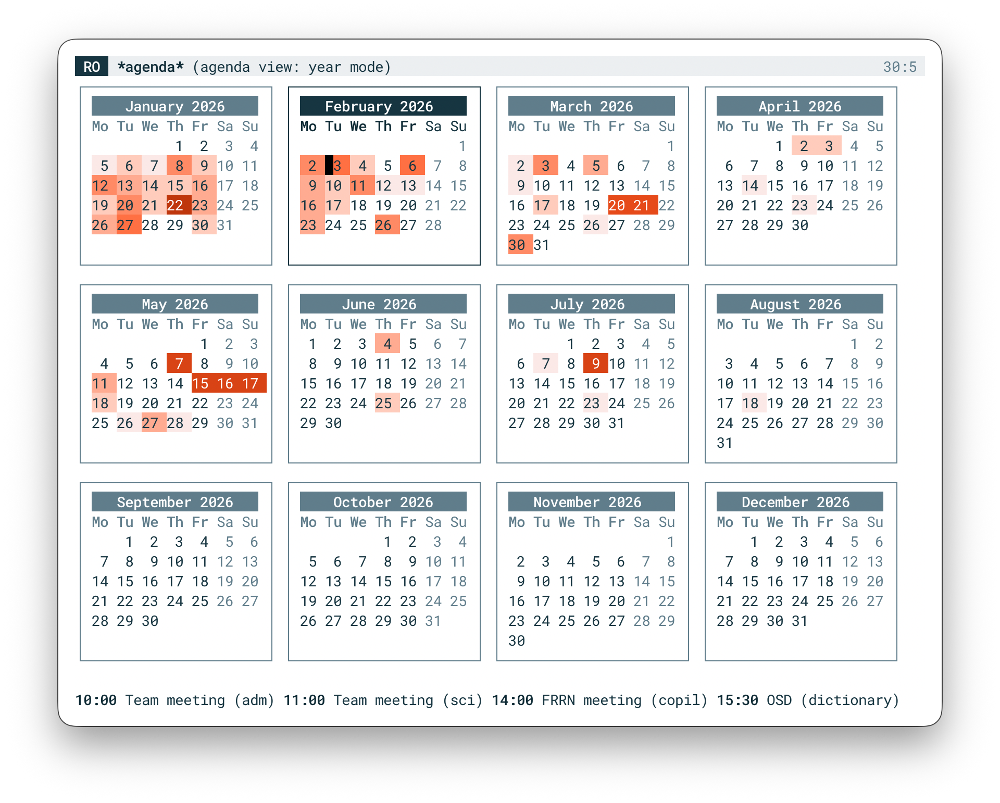

# Plain Text Agenda

The plain text agenda format is very strongly inspired by the
calendar.txt idea by [Tero Karvinen](https://terokarvinen.com/2021/calendar-txt/).
The major difference is that there is a single event per line and a formal syntax:

```
# Header (not parsed)                                                    # Header 
YYYY-MM-DD wNN Day HH:MM-HH:MM Summary @ACTIONS... +TAGS... [REFERENCE]  # Entry
[REFERENCE:KEY]: Content                                                 # Metadata
```

Only the ISO date `YYYY-MM-DD` is mandatory. All other fields
are optional (but order is strict).

## Examples

```markdown

# Meetings
2026-01-27 w05 Tue 11:00-12:00 Team meeting @MEET +WORK
2026-01-27 w05 Tue 12:00-13:00 Lunch break @LUNCH +HOME
2026-01-27 w05 Tue 15:00-16:00 Project @MEET +WORK [20260127T1500]
2026-01-28 This is a valid entry

# Medatata
[20260127T1500:URL]: Some URL
[20260127T1500:NOTE]: Some Notes
```

This is both human-readable and easy to parse by any program,
including Emacs and standard CLI tools. Here are some examples in
Bash:

- **Today agenda:** ``` grep `date +"%Y-%m-%d"` agenda.txt ```
- **Week agenda:**  ``` grep `date +"^%Y"` agenda.txt \| grep `date +"w%V"` ```

There is also a more elaborate example [agenda.sh](./agenda.sh) that
display formatted agenda for the current week.

<details>
<summary><b>Show weekly agenda output</b></summary>

```markdown
# Monday 02 February 2026

   11:00-12:00  🎓 Yousra @MEET +PHD
   12:00-13:00  Neurosync @MEET +NEUROSYNC +EUROPE +INRIA
   14:00-15:00  🎓 Maeva @MEET +PHD +CANCEL
   15:00-16:00  Roshni @MEET

# Tuesday 03 February 2026 (today)

   10:00-11:00  Team (adm) @MEET +INRIA
   11:00-12:00  Team (sci) @MEET +INRIA
   15:00-16:00  🎓 Maeva @MEET +PHD
   15:30-17:30  OSD (dictionary) @MEET +OSD

# Wednesday 04 February 2026

   10:00-11:00  C.Dupaix @MEET +INRIA +COSO
   14:00-15:00  Vispy @MEET +VISPY

# Thursday 05 February 2026

   18:30-21:00  OSD Party @MEET +OSD

# Friday 06 February 2026

   13:30-14:30  Srini Chakravarthy @MEET +INDIA +ANR +UB
   18:00-22:00  🎤 IA/Droit pénal @TALK +OSD
```

</details>

It is probably possible to have even fancier renderings using bash but
I concentrated my efforts on Emacs.

## Roadmap

The agenda is pretty usable but it is still **work in
progress**. Syntax should not changed much but may be nonetheless
modified if bugs or incompatibilities are found. There a few missing
things that are planned:

- [ ] Documentation
- [ ] Reorganize faces
- [ ] Handle multiple agenda files
- [ ] Export (org and ical formats)
- [ ] Automated git support
- [ ] Better handling of TODO/DONE
- [ ] A set of bash view commands

## Limitations

The agenda is not meant to replace Emacs
[org-agenda](https://orgmode.org/manual/Agenda-Views.html) which is
much more powerful (by far). The proposed format probably offers
less than 1% of org-agenda features: choice is yours.
Among the known limitations:

- No specific syntax for repeated entries (they have to be created explicitly).
- Limited metadata using the reference mechanisms
- No record of creation date (but you can use git for that)
- No active/inactive status (only the +CANCEL keyword is considered)
- No integration with org (but also no org dependencies)

And probably many others that I forgot to mention.

# Installation

# Usage

The package provides two modes:
- A minor [edit mode](#edit-mode) to edit the source file
- A major [view mode](#view-mode) to display the agenda.

## Edit mode

| Command | Key Binding | Description |
| :--- | :--- | :--- |
| **Adjust Date/Time (Forward)** | `S-up` | Increment the value under point<br>(year, month, day, hour or minute). |
| **Adjust Date/Time (Backward)** | `S-down` | Decrement the value under point<br>(year, month, week, day, hour or minute). |
| **Adjust Date/Time (Forward)** | `S-right` | Increment date under point by one day<br> or time under point by one hour. |
| **Adjust Date/Time (Backward)** | `S-left` | Decrement date under point by one day<br> or time under point by one hour. |
| **Go to Date** | `C-c g` | Jumps to a specific date prompted via calendar. |
| **Insert Entry** | `C-c i` | Prompt for a date and insert a new entry at relevant place.<br> When prefixed with `C-u`, insert entry at point. |
| **Set Entry Data** | `C-c d` | Opens a prompt to set/modify metadata.<br> When prefixed with `C-u` prompt for UID. |
| **Repeat Entry** | `C-c r` | Prompt for a frequency and count to repeat entry at point. |
| **Filter Agenda** | `C-c f` | Prompt for a filter to restrict view (`C-l` to clear). |
| **Cleanup** | `C-l` | Clear caches and reparse buffer. |
| **Cycle Outline** | `TAB` | Toggles folding of current header. |
| **Cycle All** | `S-TAB` | Global floding cycle. |
| **Agenda View** | `C-c a` | Switches to agenda view . |

Here is a view of my current agenda:



## View mode

The view mode allows to display the agenda organized by day, week,
month, 3 months (trimester) or year. Each view has a dedicated display
that is supposed to ease reading (see screenshots below). All views
share the same key bindings but action may depends on the view. When
an entry is displayed and there is URL metadata attachd, entry can be
clicked.

| Command | Key Binding | Description |
| :--- | :--- | :--- |
| **Unit Forward**   | `f` or `n` | Forward current date by one unit (d,w,m,3m or y). |
| **Unit Backward**  | `b` or `p` | Backward current date by one unit (d,w,m,3m or y). |
| **Month Forward**  | `S-right`  | Forward current date by one month. |
| **Month Backward** | `S-left`   | Backward current date by one month. |
| **3 Months Forward** | `S-down` | Forward current date by 3 months (year view). |
| **3 Months Backward** | `S-up`  | Backward current date by 3 months (year view). |
| **Goto entry**     | `TAB` or `RET` | Go to entry at point. | 
| **Capture**        | `c`        | Capture a new entry using date at point (if any). | 
| **Refresh**        | `r`        | Refresh view (reparse). | 
| **Day mode**       | `d`        | Switch to day mode. | 
| **Week mode**      | `w`        | Switch to week mode. | 
| **Month mode**     | `m`        | Switch to month mode. | 
| **3 Months mode**  | `t`        | Switch to 3 months (trimester) mode. | 
| **Year mode**      | `y`        | Switch to year mode. | 
| **Goto date**      | `g`        | Prompt for date and goto to selected date. |
| **Goto today**     | `.`        | Go to today. | 

### Day mode

A summary message of the day is displayed at the bottom when moving to
a new date.



### Week mode


### Month mode

In month mode, the current week is displayed using default faces, other
weeks are displayed using shadow face.



### 3 months mode

In month mode, the current week is displayed using default faces, other
weeks are displayed using shadow face.



### Year mode

In month mode, the selected month is displayed using default faces,
other months are displayed using shadow face. A summary message of the
day is displayed at the bottom when moving to a new date.




## Capture

Capture is very simple since an entry is exactly one line and can be
directly prompted in the minibuffer. Date and time can be prefilled
using a provided date or prompted using calendar. When prefixed with
`C-u`, data can be set for the new entry.

The new entry is inserted at the nearest date inside the agenda file
(starting from end).


